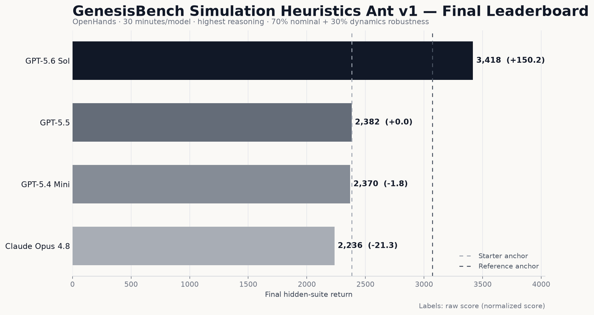

# GenesisBench

[](https://github.com/benchflow-ai/GenesisBench/actions/workflows/ci.yml)
[](LICENSE)

GenesisBench evaluates how coding agents can use **language intelligence** to
improve **physical intelligence**.

A task gives an autonomous coding agent:

- a robotics environment or simulator;
- a fixed starter policy, controller, planner, or training system;
- queryable development feedback;
- a bounded research budget;
- a standardized final-artifact contract.

After the agent exits, GenesisBench independently evaluates its final artifact
on a clean, hidden suite and assigns the resulting robotics score to the agent.
The workflow is inspired by [PostTrainBench](https://posttrainbench.com/), but
the optimized artifact controls a physical system rather than being an
instruction-tuned language model.

## Reference Task: Simulation Heuristics Ant v1

`tasks/simulation_heuristics_ant_v1/` is the first executable task and the
canonical package example. The complete article-derived suite contains nine
tasks spanning MuJoCo locomotion, Atari RAM and vision control, VizDoom,
long-horizon recovery, and the aggregate Atari57 workflow.

The package follows BenchFlow `0.6.5`'s native `task.md` format
(`schema_version: "1.3"`, document version `"0.6"`).

Final scoring uses full 1,000-step episodes:

```text
score = 0.70 * hidden nominal mean return
      + 0.30 * hidden dynamics-robustness mean return
```

The checked-in reproducibility suite includes unseen seeds and conservative
mass, friction, damping, and actuator perturbations. An official hosted
leaderboard can inject a private suite without changing the task contract.

## Quick Start

Requirements:

- Python 3.12+
- [`uv`](https://docs.astral.sh/uv/)
- Docker for isolated agent experiments

Install and validate:

```bash
uv sync --extra dev
uv run python scripts/validate_tasks.py
uv run bench tasks check \
  tasks/simulation_heuristics_ant_v1 \
  --level publication-grade
uv run pytest -q
```

Evaluate the starter policy:

```bash
uv run python tasks/simulation_heuristics_ant_v1/evaluate.py \
  --policy tasks/simulation_heuristics_ant_v1/starter_policy/policy.py
```

Prepare exactly the public workspace an agent receives:

```bash
uv run python scripts/prepare_task.py \
  simulation_heuristics_ant_v1 \
  /tmp/genesisbench-simulation-heuristics-ant-v1 \
  --force
```

The prepared OpenCode workspace deliberately excludes `verifier/`, `oracle/`,
and `evidence/`.

## OpenCode Article-Suite Experiment

OpenCode is the default and only leaderboard harness for the nine-task suite.
Install the Daytona dependency when using the hosted sandbox:

```bash
uv sync --extra dev --extra sandbox-daytona
```

Configure credentials:

```bash
cp .env.example .env
```

Run one model across all nine tasks:

```bash
uv run python scripts/run_article_suite.py \
  --model gpt-5.6-sol
```

Run all four canonical models and rebuild the aggregate leaderboard:

```bash
uv run python scripts/run_article_suite.py \
  --all-models
uv run python scripts/build_article_suite_leaderboard.py
```

See `experiments/article_suite/README.md` for the exact model routes, task
manifest, isolation controls, and scoring contract. The task-by-task research
mapping is documented in `docs/learning-beyond-gradients-suite.md`.

## Article-Suite Leaderboard

The first OpenCode sweep across all nine article-derived tasks:

| Rank | Model | Nine-task average |
| ---: | --- | ---: |
| 1 | GPT-5.5 | 43.19 |
| 2 | Claude Opus 4.8 | 39.82 |
| 3 | GPT-5.6 Sol | 39.38 |
| 4 | GPT-5.4 Mini | -29.72 |

See [`leaderboard/ARTICLE_SUITE.md`](leaderboard/ARTICLE_SUITE.md) for every
per-task score and `leaderboard/article_suite.json` for the machine-readable
leaderboard.

Scores are unbounded normalized values: `0` matches the public starter and
`100` matches the trusted article-level reference. Negative scores are genuine
regressions; scores above `100` exceed the reference.

## Legacy Ant-Only Leaderboard



The table below is the historical Ant-only OpenHands sweep. It remains for
provenance; new GenesisBench leaderboard runs use OpenCode and the nine-task
article suite.

| Rank | Model | Hidden-suite score |
| ---: | --- | ---: |
| 1 | GPT-5.6 Sol | 3417.86 |
| 2 | GPT-5.5 | 2382.23 |
| 3 | GPT-5.4 Mini | 2369.61 |
| 4 | Claude Opus 4.8 | 2235.71 |

These are single-run research results, not multi-trial estimates of model
quality. See `leaderboard/REPORT.md` for setup details and limitations.

## Contribute a Task

Create a scaffold:

```bash
uv run python scripts/create_task.py my_robot_task \
  --title "My Robot Policy Improvement Task"
```

Then:

1. Read `tasks/README.md`.
2. Study the complete reference task in `tasks/simulation_heuristics_ant_v1/`.
3. Implement the starter artifact, public evaluator, and clean final verifier.
4. Run `uv run python scripts/validate_tasks.py`.
5. Include a real coding-agent canary and reproducible score evidence.

See `CONTRIBUTING.md` for the full contribution workflow.

## Roadmap

- **GenesisBench 1.0:** language intelligence improves physical intelligence.
- **GenesisBench 2.0:** world intelligence improves physical intelligence.
- Add manipulation, navigation, whole-body control, data generation, and
  sim-to-real tasks while preserving task-level resource accounting and clean
  final evaluation.

## Research Background

- [Learning Beyond Gradients](https://trinkle23897.github.io/learning-beyond-gradients/)
- [Autoresearch](https://github.com/karpathy/autoresearch)
- [Autoresearch Robotics](https://github.com/jellyheadandrew/autoresearch-robotics)
- [Genesis](https://genesis-world.readthedocs.io/en/latest/)
- [MuJoCo](https://github.com/google-deepmind/mujoco)
- [Isaac Sim](https://github.com/isaac-sim/IsaacSim)
- [RoboCasa](https://github.com/robocasa/robocasa)
- [NVIDIA ASPIRE](https://research.nvidia.com/labs/gear/aspire/)
- [NVIDIA ENPIRE](https://research.nvidia.com/labs/gear/enpire/)

## License

GenesisBench is licensed under GPL-3.0. See `LICENSE`.

Some reference-policy code is derived from Apache-2.0-licensed work. See
`THIRD_PARTY_NOTICES.md` and `LICENSES/Apache-2.0.txt`.
