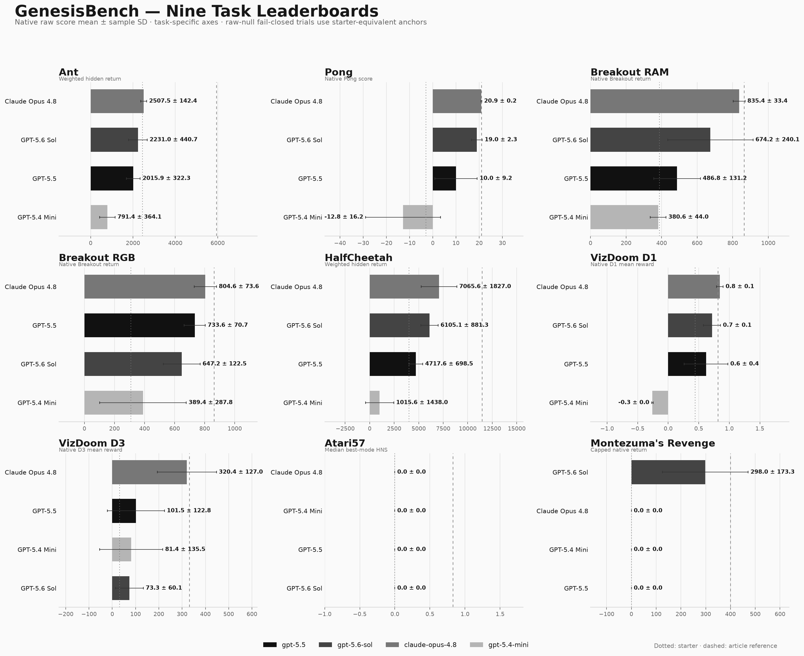
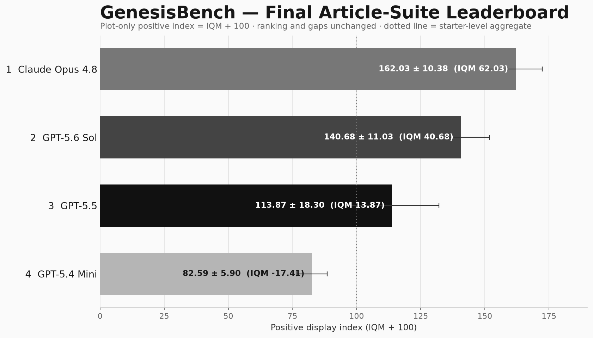

# GenesisBench Learning Beyond Gradients Article Suite

The first image contains the nine independently ranked task leaderboards. The second image contains the final cross-task ranking.

The nine task panels report five-trial mean ± sample standard deviation for each environment's native raw score.

## Leaderboards

## Final normalized score

The final score is RLiable-style IQM over the complete 5 × 9 trial-task score matrix: flatten all 45 normalized scores, trim the lowest 11 and highest 11, and average the middle 23. The displayed ± value is the sample standard deviation of the five per-trial IQMs. The image uses a plot-only positive display index equal to `IQM + 100`; raw metrics remain in the JSON.

Machine-readable rankings and score-detail paths are available in [`article_suite.json`](article_suite.json). The scoring rationale is documented in [`docs/article-suite-scoring.md`](../docs/article-suite-scoring.md).

The selected trajectory timeout audit is available in [`article_suite_timeout_fairness_audit.json`](article_suite_timeout_fairness_audit.json) and [`docs/article-suite-timeout-fairness.md`](../docs/article-suite-timeout-fairness.md).
